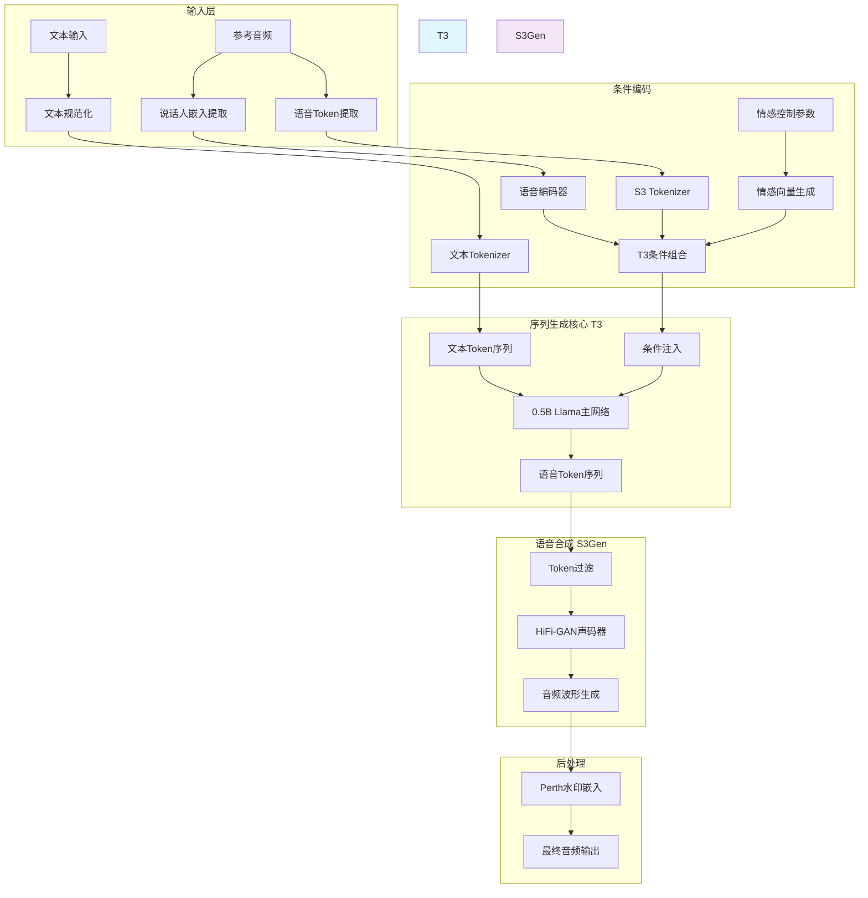
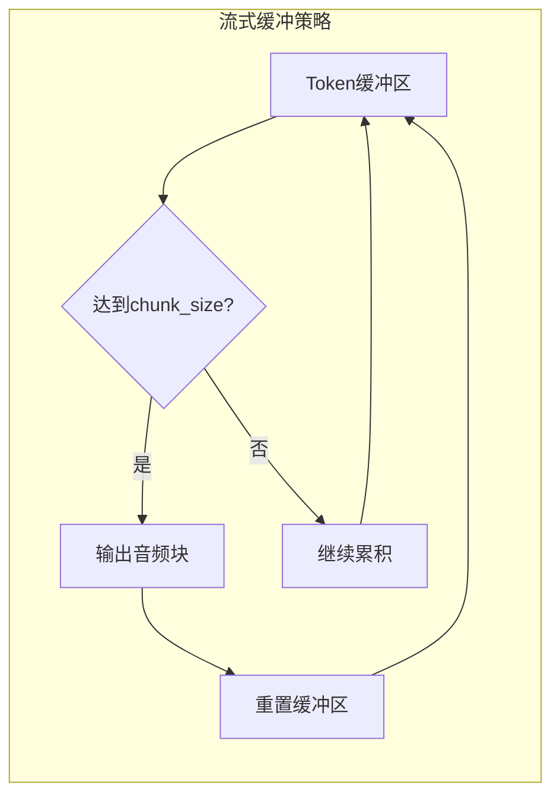
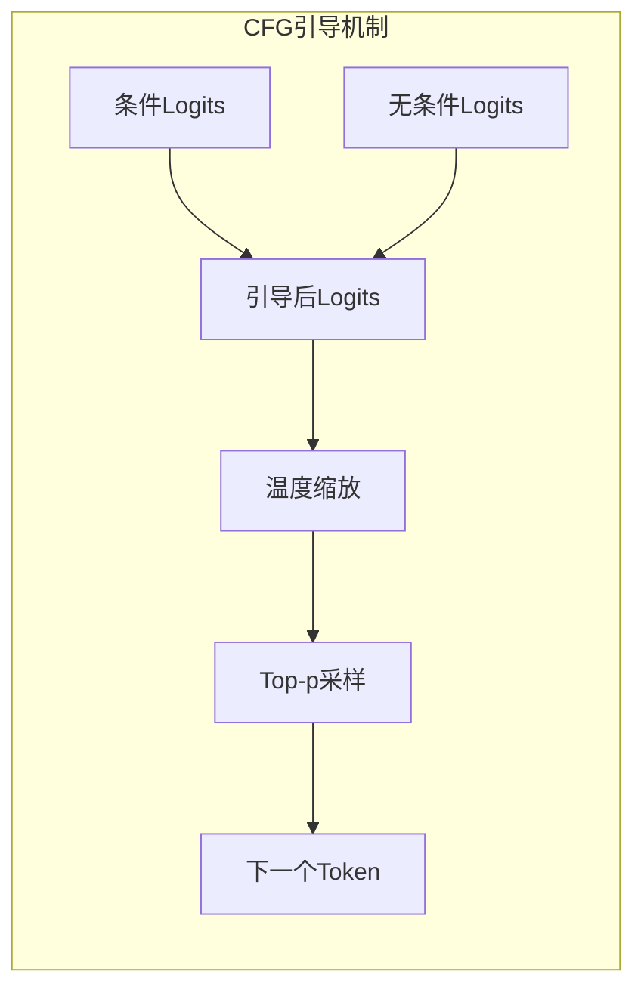
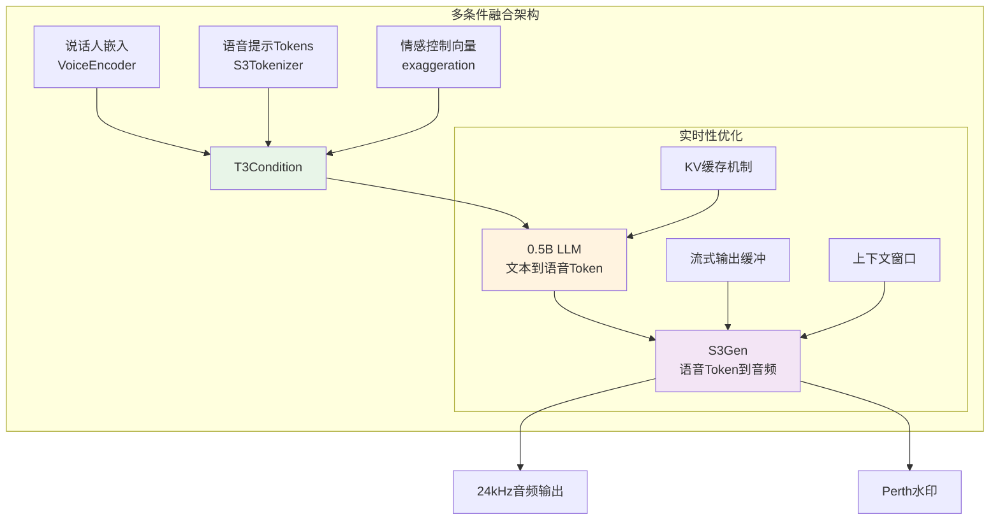

# ChatterboxTTS 架构分析与设计文档

## 概述

ChatterboxTTS 是一个基于深度学习的实时流式文本转语音系统，采用多模态条件生成框架，支持语音克隆、情感控制和实时流式输出。该系统结合了 0.5B Llama 语言模型、HiFi-GAN 声码器以及先进的水印技术，实现了高质量、低延迟的语音合成。

## 核心架构

### 系统架构图



### 核心组件

#### 1. 输入处理层
- **文本规范化** (`punc_norm`): 清理和标准化输入文本，包括标点符号处理、大小写转换
- **说话人嵌入提取** (`VoiceEncoder`): 从参考音频提取说话人特征向量
- **语音 Token 提取** (`S3Tokenizer`): 将参考音频转换为语音 token 序列

#### 2. 条件编码层
- **文本 Tokenizer** (`EnTokenizer`): 将文本转换为 token 序列
- **多条件融合** (`T3Cond`): 整合说话人嵌入、语音提示 tokens 和情感控制
- **情感控制**: 通过 `exaggeration` 参数动态调节生成语音的情感强度

#### 3. 序列生成核心 (T3)
- **0.5B Llama 主网络**: 基于轻量级 Llama 架构的文本到语音 token 生成器
- **CFG 引导**: 使用 Classifier-Free Guidance 提高生成质量
- **KV 缓存**: 支持高效的流式推理

#### 4. 语音合成层 (S3Gen)
- **HiFi-GAN 声码器**: 将语音 tokens 转换为高质量音频波形
- **Token 过滤**: 移除无效语音 tokens 确保输出质量
- **多参考支持**: 支持基于参考音频的语音克隆

#### 5. 后处理层
- **Perth 水印**: 嵌入不可感知的数字水印，支持音频溯源
- **音频质量保证**: 确保输出音频符合 24kHz 采样率标准

## 流式生成流程

### 时序图

```mermaid
sequenceDiagram
    participant User as 用户
    participant CT as ChatterboxTTS
    participant T3 as T3模型
    participant S3Gen as S3Gen生成器
    participant Audio as 音频输出

    User->>CT: generate_stream(text, audio_prompt)

    Note over CT: 条件准备阶段
    CT->>CT: prepare_conditionals()
    CT->>CT: 文本规范化和Token化

    Note over CT: 流式生成循环
    loop 每个Token
        CT->>T3: inference_stream()
        T3->>T3: 逐Token生成 (KV缓存)
        T3->>CT: 返回语音Token

        alt 累积到chunk_size
            CT->>S3Gen: inference(语音Token块)
            S3Gen->>S3Gen: HiFi-GAN合成音频
            S3Gen->>CT: 返回音频块

            Note over CT: 后处理
            CT->>CT: 添加水印
            CT->>CT: 应用淡入效果

            CT->>Audio: 实时输出音频块
            Audio->>User: 播放音频
        end

        alt 检测到EOS Token
            break 生成完成
        end
    end
```

### 流式生成策略

#### 1. Token 级流式生成


#### 2. 上下文窗口机制
- **目的**: 避免音频块之间的断裂，确保连续性
- **实现**: 每个音频块包含前 `context_window` 个 tokens 作为上下文
- **效果**: 显著提升流式音频的自然度和连续性

#### 3. 渐变处理
- **淡入效果**: 对每个音频块应用线性淡入 (`fade_duration=0.02s`)
- **平滑过渡**: 减少音频块之间的 audible artifacts
- **用户体验**: 提供更自然的实时听觉体验

## 关键技术机制

### 1. CFG 引导机制



**CFG 计算公式**:
```
logits_final = logits_cond + cfg_weight * (logits_cond - logits_uncond)
```

**参数说明**:
- `cfg_weight`: 控制引导强度，推荐值 0.3-0.5
- `temperature`: 控制采样随机性，推荐值 0.8
- `top_p`: 限制低概率 tokens，提高生成质量

### 2. 多条件融合架构



### 3. 性能优化策略

#### 计算优化
- **KV 缓存**: 避免重复计算历史 token 的注意力
- **推理模式**: 使用 `torch.inference_mode()` 减少内存占用
- **批处理优化**: 支持条件和无条件的并行计算

#### 实时性保障
- **可配置粒度**: `chunk_size` 参数允许在延迟和效率间权衡
- **异步处理**: 音频生成与播放可并行进行
- **设备适配**: 支持 CUDA、CPU、MPS 等不同计算平台

## 性能指标

### 目标性能 (4090 GPU)
- **延迟到首块**: ~0.472s
- **实时因子 (RTF)**: 0.499 (目标 < 1.0)
- **采样率**: 24kHz
- **典型块大小**: 25 tokens (~1s 音频)

### 性能调优参数
- **`chunk_size`**: 25-50 tokens，影响延迟和效率
- **`context_window`**: 50 tokens，确保音频连续性
- **`fade_duration`**: 0.02s，优化音频块过渡

## 设计原则体现

### 1. Linus 哲学原则
- **消除特殊情况**: 通过统一的多条件框架处理不同生成任务
- **向后兼容**: `generate` 和 `generate_stream` 接口保持一致
- **实用性导向**: 所有设计选择针对实时语音合成的实际需求

### 2. TDD 方法论
- **真实场景驱动**: 流式设计基于实际实时通信需求
- **错误驱动开发**: 通过 EOS token 检测和异常处理确保稳定性
- **增量改进**: 支持参数化调优和持续优化

### 3. 系统设计原则
- **模块化**: 清晰的组件分离和接口定义
- **可扩展性**: 支持新模型和技术的集成
- **鲁棒性**: 完善的错误处理和异常恢复机制

## 安全与责任

### 1. 水印技术
- **Perth 水印**: 所有生成的音频都包含不可感知的数字水印
- **溯源能力**: 支持音频内容的来源追踪和验证
- **压缩鲁棒性**: 水印在 MP3 压缩后仍然可检测

### 2. 负责任 AI
- **使用限制**: 明确禁止恶意使用
- **透明度**: 开源实现和可验证的技术方案
- **伦理考虑**: 在 README 中明确使用准则

## 未来发展方向

### 1. 性能优化
- **模型压缩**: 进一步减小模型体积和计算需求
- **量化优化**: 支持 INT8/FP16 推理
- **硬件加速**: 适配更多边缘计算设备

### 2. 功能扩展
- **多语言支持**: 扩展到非英语语言
- **实时语音转换**: 集成更多声音效果处理
- **个性化定制**: 支持用户特定的声音偏好

### 3. 质量提升
- **音质优化**: 进一步提升自然度和表现力
- **稳定性增强**: 改进长文本生成的一致性
- **自适应调节**: 根据内容自动优化参数

---

*本文档基于 ChatterboxTTS 源码分析编写，详细说明了系统的架构设计、实现原理和技术特点。*